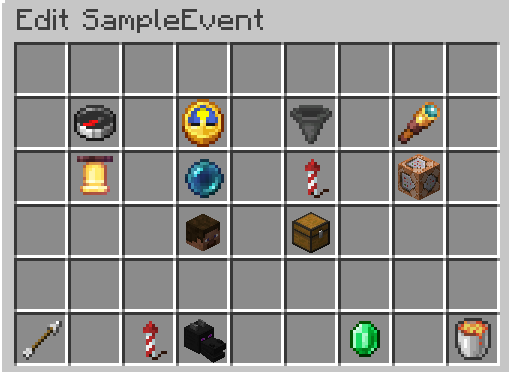

# About this plugin

Want to give something back to your players and do it in a creative way? - How about events?

With this plugin, you can give out rewards by using events and crates, with a focus on easy customizability.

## Overview: Crates

Crates are 'boxes' with custom style, which can be opened and give out a variety of rewards. You can create multiple
Crates, each of them having their own loot pool. You can configure, how rare a reward is and how it should look like.

Many things can be configured in the GUI. The base command is `/crate <subcommand>`. The list of subcommands can be seen on the tab completion and should be self-explanatory..
To gain an overview `/crate list` is a good starting point.

### Rewards:

Rewards can range from simple item drops, to complex opening procedures. It is possible to trigger multiple 'events' as a reward. You can:
- Drop items
- Play sounds
- Send the player a message
- Run a command (as the server)
- Add a delay between 'events'

This is how a more sofisticated reward could look like:

  <video src="resc/crate.mp4" autoplay loop muted playsinline width="800"></video>

We play a sound and write "Legendary reward" to the player and count down in chat. Then we drop the reward (a Beacon), along with some particles,
and broadcast, who just pulled a legendary reward. And since we dont want to configure it every time, rewards and whole crates are clonable. (Emerald button)

Additionally, since player names and things such as location are dynamic, you can paste a 'replacement code' in chat and command messages. For more info, view 'Replacement codes' at the ent of this Readme.

### View Lootpool:

If the config `crates.normal-players.view-lootpool` is `true`, non-op players are abled to preview, what drop chance
each reward has by holding a crate in their main hand and running `/crates loot`

### Pitty system:

For each crate, you can activate a pitty system. It works, as follows:

If a player is about to pull the same reward in the same rarity class (same drop chance), the pitty system chooses a 
random different reward.

Example: Our crate has 4 drops. 70% dirt, 10% diamond, 10% netherite, 10% beacon. A player now opens multiple of those 
crates. First he pulls a diamond, followed by a couple of dirt drops (which aren't subject to pitty, since they are the 
only drop with 70% chance). Next he is about to pull a diamond again - Here the pitty system comes in clutch: Due to him 
pulling the diamond with 10% chance previously, the pitty system now grants him a different drop with the rarity of 10%. 
So instead of the diamond, he'll pull either the netherite or the beacon - both are possible.

## Overview: Dropevents

  <video src="resc/dropevent.mp4" autoplay loop muted playsinline width="800"></video>

In a Dropevent random rewards, set by you, drop from the sky and players can compete with each other to get as many, as
they can. You can configure them to be in a more private, or public environment, by choosing, if the dropevents get 
announced in chat,  if players are abled to teleport to them and so on.

The base command is `/dropevent <subcommand>` or `/de <subcommand>`. The list of subcommands can be seen on the tab 
completion and should be self-explanatory.
To gain an overview `/de list` is a good starting point.

### Settings:

You get to the settings by clicking on an event in the list GUI or by running `/de info abc`

You are able to configure the following:
- Range: Up to what distance from the start location drops can occur
- Duration: How long the Dropevent runs for
- Dropped items: Total amount of items dropped during the event
- Countdown: Time, how long players have time to prepare for the Dropevent
- Broadcasting: Whether a customizable broadcast message should announce that a dropevent takes place and potentially 
where it is and an option to teleport (See next setting)
- Teleportable: Whether the broadcast message gets appended a 'Teleport' button for players to teleport to the event or 
alternatively use `/de tp <code>`. Players can teleport to the location once and only as long as the Dropevent takes place.
- Render item: Configure how the event appears in the list and how the item, players can obtain to start events 
themselves, appears.
- Command on startup: Command that gets run by console once the countdown timer runs out
- Min. players to start: Restriction, how many players have to be at least online, before the Dropevent can be started

From this page, you can also: Go to the loot pool of the event, start the event (optionally without countdown), clone or delete 
the event. 

### Loot pool:

In the loot pool, you can configure, what items should be dropped and at what chance. You can set all kinds of items as 
drops - for example: Crates.

**Note:** Due to the choice, which item gets dropped being decided randomly, influenced by the chance modifier, it is
possible for the real count of dropped items of one rarity to slightly deviate from expectation.

### Event starter item:

Operators can start events in the info screen, aswell as the command `/de start <name>`. Non-op players aren't able to
start events in these ways. If you want to give them the ability, to do it anyway, you can give out starter items by
running the command `/de give <player name> <dropevent name> <amount>` (or adding those items to Crates etc.).
The player holding them can now start an event at their location (if all requirements are met) by crouching + right-clicking.

**Warning:** Those items are deactivated by default. To activate them, change the config `dropevents.normal-players.usable` 
to `true`.

# More configurations

### Chat messages:

Most of the messages, the plugin sends to players are editable. You can find and edit the chat message file in 
`<YourServerFolder>/plugins/CratesAndDropevents/messages.yml`.

File changes have their effect after server restart or running `/cad reload`.

### Settings:

There are some global settings, which can be viewed by running `/cad config`. 
They can be changed by running `/cad config <key> <value>`.

**Explanation:**
- `dropevents.simultaneous-limit.count`: Sets the maximum number of Dropevents that can take place at the same time.
- `dropevents.simultaneous-limit.active`: Defines, whether the previous setting is actively applied.
- `dropevents.normal-players.usable`: Defines, whether non-op players are able to use Dropevent starter items.
- `dropevents.forbidden-worlds`: A list, where Dropevents cannot be started.
- `dropevents.hopper-prevention`: Checks an area, before a Dropevent starts for hoppers which could potentially pick up 
dropped items and denies the start if it finds any.
- `dropevents.ops-override-restrictions`: Defines, whether Ops (or players with permission) are able to start Dropevents,
even when criteria like player count, dimension, hoppers in area would prevent the start.
- `dropevents.bossbar-countdown`: Shows a countdown in the countdown phase, when the Dropevent will start.
- `dropevents.starter-dragon`: Defines, whether a dying dragon (the animation) spawns, when a Dropevent starts.
- `crates.normal-players.view-lootpool`: Defines, whether normal players can view a Crates loot pool with `/crates loot`.
- `gui.play-sounds`: Defines, whether gui items play a sound when clicked.

Note that there are different data types, such as Numbers, True/False values, Lists and so on. If you try to change a 
setting to a false data type, for example `dropevents.simultaneous-limit.count` to `abc` this will get rejected with the 
message `Mismatched data types`.

If you edit a List, the value you type in will either be removed, if already present in the list, or added to the list, 
if absent.

## Replacement codes

Some chat messages and commands are subject to 'replacement codes', which means you can inject data at a placeholder.

### Chat messages:

The following chat elements can use replacement codes:
- `dropevent.broadcast.local.countdown`
- `dropevent.broadcast.local.start`
- `dropevent.broadcast.local.end`
- `dropevent.broadcast.global.countdown`
- `dropevent.broadcast.tp-prompt.chat`
- `dropevent.broadcast.tp-prompt.hover`

The following sequences are replaced:

- `%c` with the x, y, and z coordinates of the Dropevent, separated by comma.
- `%w` with the name of the world, the Dropevent takes place in.
- `%t` with the countdown of the Dropevent in seconds. It always refers to the max. value, not the current
- `%n` with the name of the Dropevent.
- `%l` with the "location name". This name gets defined when starting a Dropevent by command and adding this optional
value (`/de start <event name> <location name>`)
- `%h` with the name of the player who started the Dropevent.

**Special Case:** `%p`

The button to teleport to an event can be inserted to a message with the code `%p`. It only gets displayed if it is
possible to teleport to this event. This button visually defined in `dropevent.broadcast.tp-prompt.chat`
 and `dropevent.broadcast.tp-prompt.hover` and can therefore only be inserted into the other 4 messages, previously mentioned. 

### Commands:

**Command on Dropevent startup:**

The command, that gets executed, when a Dropevent starts has the following replacement codes:
- `%p` replaced with the name of the player starting the event.
- `%w` replaced with the world key, the Dropevent takes place in.
- `%l` replaced with the location, where the Dropevent starts.

**Command Reward:**

Commands in reward sequences of Crates have the following replacement codes:
- `%p` replaced with the name of the player who opened the Crate.
- `%w` replaced with the world key, the Crate got opened in.
- `%l` replaced with the location, where the Crate was placed.

